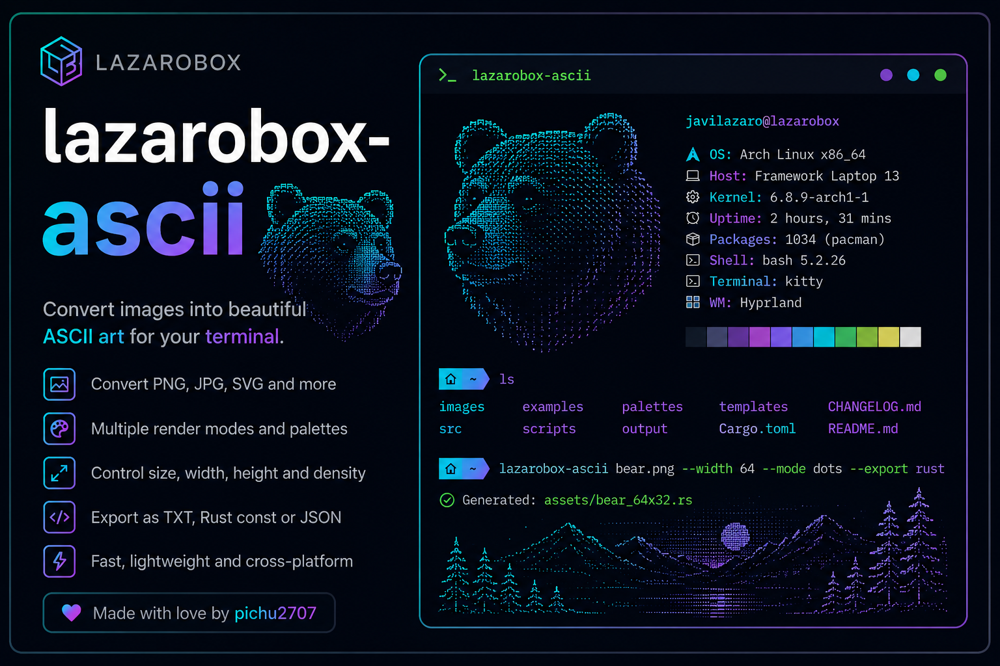

<p align="center">
  
</p>

<h1 align="center">LazaroBox Image</h1>

<p align="center">
  Optimizador de imágenes y editor de metadatos, en la terminal.<br>
  CLI para automatizar · TUI interactiva para trabajar cómodo.
</p>

<p align="center">
  
  
  
  
</p>

---

## ✨ Qué es

**LazaroBox Image** es una herramienta en Rust para **optimizar imágenes** (redimensionar
y comprimir) y **leer/editar sus metadatos** (EXIF), pensada tanto para scripts como para
uso interactivo.

- **Sin argumentos** abre una **TUI interactiva** (basada en [ratatui](https://ratatui.rs)):
  navegás carpetas, elegís imágenes y ves los resultados sin salir del teclado.
- **Con argumentos** funciona como **CLI** clásica, ideal para automatizar lotes.

## 🚀 Características

- 🗜️ **Optimización** — redimensiona por ancho/alto y comprime con calidad configurable.
- 🔄 **Conversión** de formatos entre **WebP, PNG y JPEG**.
- 🔍 **Inspección** — dimensiones, tamaño y formato de cualquier imagen.
- 🏷️ **Metadatos** — lee EXIF y **edita a disco**: poner **GPS**, quitar **metadatos de IA**
  y editar/añadir **alt text**.
- 📁 **Navegador de archivos** integrado — nada de escribir rutas a mano.
- 📊 **Barra de progreso** en el procesado por lotes, con **cancelación** (`Esc`).
- 🐻 Interfaz con estilo LazaroBox, en español.

## 📦 Instalación

### Homebrew

La forma más cómoda de instalarlo en macOS o Linux es con Homebrew:

```bash
brew install pichu2707/tap/lazarobox-img
```

Después podés abrir la TUI ejecutando:

```bash
lazarobox-img
```

### Desde el código fuente

Necesitás [Rust](https://rustup.rs) (edición 2024).

```bash
git clone https://github.com/pichu2707/lazarobox-img.git
cd lazarobox-img

# Compilar en modo release
cargo build --release

# O instalarlo en el PATH
cargo install --path .
```

El binario queda en `target/release/lazarobox-img`.

## 🖥️ Uso

### Modo interactivo (TUI)

Ejecutá sin argumentos:

```bash
lazarobox-img
```

Se abre el menú principal. El navegador arranca en la carpeta desde donde lo lanzaste.

**Controles**

| Contexto            | Teclas                                                              |
| ------------------- | ------------------------------------------------------------------ |
| Menú principal      | `↑ ↓` navegar · `Enter` elegir · `q` / `Esc` salir                 |
| Navegador           | `↑ ↓` mover · `Enter` abrir carpeta / elegir archivo · `Backspace` subir · `Esc` volver |
| Optimizar (config)  | `↑ ↓` campo · `← →` ajustar · `0-9` anchura/alto · `Enter` optimizar |
| Optimizar (proceso) | `Esc` cancelar (conserva lo ya hecho)                              |
| Convertir           | `← →` cambiar formato de destino                                    |
| Metadatos           | `e` editar · en el editor: `↑ ↓` campo · `← →` alternar · `Enter` guardar |

### Modo CLI

```bash
lazarobox-img <ENTRADA> [OPCIONES]
```

`<ENTRADA>` puede ser una imagen o una carpeta (primer nivel).

| Opción              | Descripción                          | Por defecto |
| ------------------- | ------------------------------------ | ----------- |
| `-w`, `--width <N>` | Ancho máximo de salida (px)          | —           |
| `--height <N>`      | Alto máximo de salida (px)           | —           |
| `-q`, `--quality`   | Calidad de salida (1–100)            | `80`        |
| `-f`, `--format`    | Formato: `webp`, `jpg`, `png`        | `webp`      |

**Ejemplo**

```bash
# Optimizar una carpeta a WebP, máximo 1200px de ancho
lazarobox-img ./fotos --width 1200 --quality 82 --format webp
```

Los resultados se escriben en una carpeta `optimized-<nombre>/` junto a la entrada.

## 🖼️ Formatos soportados

| Formato | Optimizar / Convertir | Leer metadatos | Escribir metadatos |
| ------- | :-------------------: | :------------: | :----------------: |
| WebP    |          ✅           |       ✅       |         ✅         |
| JPEG    |          ✅           |       ✅       |         ✅         |
| PNG     |          ✅           |       ✅       |         ❌         |
| AVIF    |   ⏳ (pendiente)      |       —        |         —          |

> La **escritura** de metadatos está validada en **JPEG y WebP**. En PNG solo se leen
> (los distintos lectores usan chunks incompatibles). AVIF está en el roadmap.

## 🏷️ Edición de metadatos

Desde la pantalla **Metadatos**, tras leer una imagen, pulsá `e` para editar:

- **GPS** — poné latitud y longitud (grados decimales) o quitá las coordenadas.
- **Quitar IA** — elimina las trazas de metadatos de herramientas de IA.
- **Alt text** — editá o añadí la descripción de la imagen.

Los cambios se **escriben en el archivo** (mediante [`little_exif`](https://crates.io/crates/little_exif))
y se vuelven a leer para confirmar.

## 🏗️ Arquitectura

Separación por responsabilidades, con la TUI trabajando **siempre sobre el estado**
(nunca directamente sobre el motor):

```
src/
├── app/           # Estado (fuente única de verdad), controlador y navegador de archivos
├── tui/           # Pantallas, widgets, bucle de eventos y terminal (ratatui)
├── metadata/      # Lectura (EXIF) y escritura (editor) de metadatos + parsers
├── encoders/      # WebP · PNG · JPEG
├── optimizer.rs   # Motor de redimensionado
├── converter.rs   # Conversión de formatos
├── scanner.rs     # Descubrimiento de imágenes
├── export.rs      # Rutas y carpetas de salida
└── inspector.rs   # Información básica de una imagen
```

## 🗺️ Roadmap

| Versión | Foco                                    | Estado |
| ------- | --------------------------------------- | :----: |
| v0.1    | Motor de optimización                   |   ✅   |
| v0.2    | Motor de metadatos (lectura)            |   ✅   |
| v0.3    | Arquitectura y capa de UI               |   ✅   |
| v0.4    | Plan de metadatos y writer lógico       |   ✅   |
| v0.5    | Interfaz interactiva Ratatui            |   ✅   |
| v0.6    | Escritura física de metadatos (GPS/IA/alt) | 🚧 en curso |
| v0.7    | Formatos avanzados y perfiles de metadatos |   ⏳   |
| v1.0    | Release estable + Homebrew              |   ⏳   |

## 📄 Licencia

[MIT](LICENSE) © pichu2707

---

<p align="center">Hecho con 🦀 y 🐻 · <b>LazaroBox</b></p>
